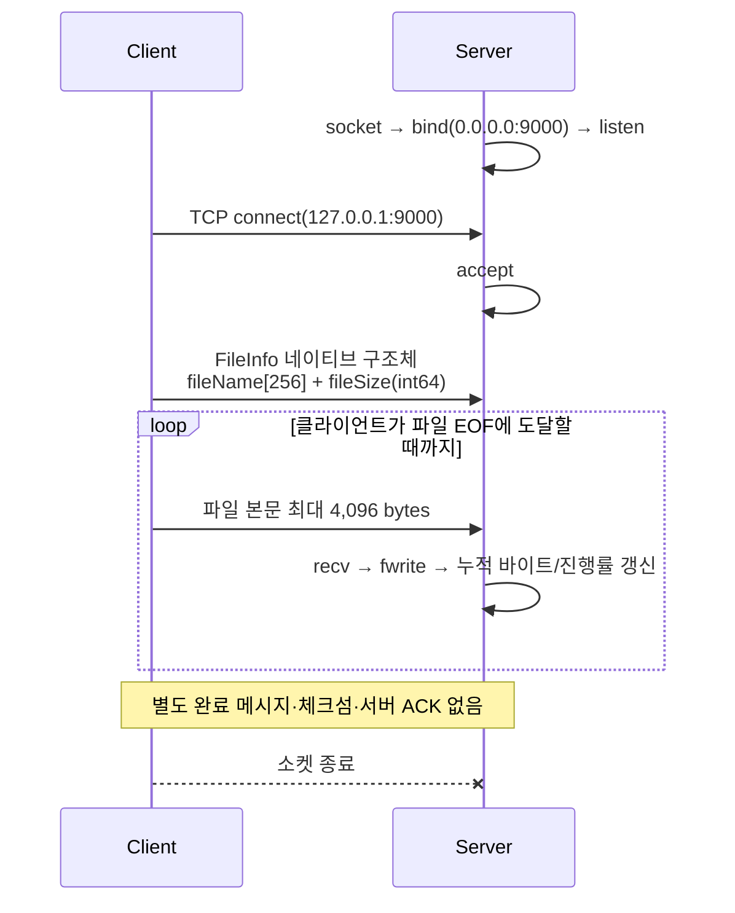

# Winsock2 TCP File Transfer

C++와 Winsock2로 파일 메타데이터와 본문을 TCP 스트림으로 전송하고, 서버 콘솔에서 수신 진행률을 갱신하는 네트워크 프로그래밍 과제입니다.

> 현재 저장소에는 `HW03: 파일 전송 및 진행률 표시` 한 과제만 포함되어 있습니다. 아래 내용은 저장소의 실제 코드와 로컬 빌드·실행 검증 결과를 기준으로 작성했습니다.

## 프로젝트 요약

| 항목 | 내용 |
| --- | --- |
| 개발 시기 | 2025년 10월 |
| 프로젝트 형태 | 네트워크 프로그래밍 개인 과제 |
| 구현 범위 | TCP 클라이언트·서버, 파일 메타데이터/본문 전송, 수신 진행률 표시 |
| 기술 | C++, Winsock2, TCP/IP, Visual Studio 2022, MSVC v143 |
| 기본 연결 | 클라이언트 `127.0.0.1:9000` → 서버 `0.0.0.0:9000` |
| 현재 상태 | Release x64 빌드 및 로컬 루프백 파일 전송 검증 완료 |

GitHub 커밋 이력 기준 두 커밋 모두 `douyun0623`이 작성했으며, 다른 기여자나 PR 기록은 없습니다. 클라이언트와 서버 구현도 같은 사용자 커밋에 포함되어 있습니다.

## 핵심 구현

### 클라이언트

- 명령행 인수로 전송할 파일을 선택합니다.
- 파일명과 파일 크기를 `FileInfo` 구조체에 담아 먼저 전송합니다.
- 파일 본문을 최대 4,096바이트 단위로 읽어 TCP 소켓으로 전송합니다.
- 서버 주소와 포트는 현재 코드에 `127.0.0.1:9000`으로 고정되어 있습니다.

### 서버

- 모든 로컬 네트워크 인터페이스의 TCP 9000번 포트에서 연결을 기다립니다.
- 한 클라이언트의 접속을 수락하고, 파일 정보와 본문을 순서대로 수신합니다.
- 누적 수신 바이트를 파일 크기로 나누어 진행률을 계산합니다.
- `\r`을 사용해 콘솔 한 줄에서 진행률을 0%부터 100%까지 갱신합니다.

## 전송 프로토콜



메타데이터는 다음 구조체의 `sizeof(FileInfo)` 바이트를 별도 직렬화 없이 그대로 전송합니다.

```cpp
struct FileInfo {
    char fileName[256];
    long long fileSize;
};
```

서버는 광고된 `fileSize` 이상을 받을 때까지 본문을 수신합니다. TCP 연결 종료 외에 독립적인 전송 완료 프레임은 없습니다.

## 저장소 구조

```text
.
├─ Common/
│  └─ Common.h                         # Winsock 헤더, 링크 설정, 오류 출력 함수
└─ hw03_file-transfer-progress/
   ├─ README.md                        # 기존 과제 설명
   ├─ client/
   │  ├─ client.sln
   │  └─ client/client.cpp             # 파일 정보·본문 송신
   └─ server/
      ├─ server.sln
      └─ server/server.cpp             # 파일 수신·저장·진행률 표시
```

## 빌드 방법

### 요구 환경

- Windows 10/11
- Visual Studio 2022
- `Desktop development with C++` 워크로드
- MSVC v143 및 Windows 10 SDK

두 솔루션은 서로 분리되어 있습니다. Visual Studio에서 각각 열어 `Release | x64`로 빌드하거나, **Developer PowerShell for VS 2022**에서 다음 명령을 실행합니다.

```powershell
msbuild .\hw03_file-transfer-progress\server\server.sln /m /t:Build /p:Configuration=Release /p:Platform=x64
msbuild .\hw03_file-transfer-progress\client\client.sln /m /t:Build /p:Configuration=Release /p:Platform=x64
```

기본 출력 위치는 다음과 같습니다.

```text
hw03_file-transfer-progress/server/server/x64/Release/server.exe
hw03_file-transfer-progress/client/client/x64/Release/client.exe
```

> `Release | Win32`는 두 프로젝트 모두 공용 헤더 경로가 빠져 있어 현재 `Common.h`를 찾지 못하고 빌드에 실패합니다. 검증된 `Release | x64` 구성을 사용해 주세요.

## 실행 방법

서버는 클라이언트가 전달한 파일명을 현재 작업 디렉터리에 그대로 생성합니다. 원본 덮어쓰기를 방지하려면 송신 폴더와 수신 폴더를 반드시 분리하세요.

다음 예시는 저장소 밖의 임시 폴더에 실행 환경을 준비합니다.

```powershell
$DemoRoot = Join-Path $env:TEMP "winsock-file-transfer-demo"
New-Item -ItemType Directory -Force "$DemoRoot\send", "$DemoRoot\receive"

Copy-Item .\hw03_file-transfer-progress\client\client\x64\Release\client.exe "$DemoRoot\send\"
Copy-Item .\hw03_file-transfer-progress\server\server\x64\Release\server.exe "$DemoRoot\receive\"
Copy-Item C:\path\to\your-own-sample.mp4 "$DemoRoot\send\sample.mp4"
```

터미널 A에서 서버를 먼저 실행합니다.

```powershell
Set-Location "$DemoRoot\receive"
.\server.exe
```

터미널 B에서 파일명을 인수로 전달해 클라이언트를 실행합니다.

```powershell
Set-Location "$DemoRoot\send"
.\client.exe sample.mp4
```

정상 수신 시 서버에 다음과 같은 진행률이 한 줄에서 갱신됩니다.

```text
수신 진행률: 100% (824516 / 824516 bytes)
파일 수신을 완료했습니다.
```

## 검증 결과

2026-08-08에 Windows와 Visual Studio 2022/MSVC v143 환경에서 저장소 밖의 빌드·실행 디렉터리를 사용해 검증했습니다.

| 구성 | 서버 | 클라이언트 |
| --- | --- | --- |
| Debug x64 | 성공, 경고 없음 | 성공, 경고 2개 |
| Release x64 | 성공, 경고 없음 | 성공, 경고 2개 |
| Debug x86 | 성공, 경고 없음 | 성공, 경고 1개 |
| Release x86 | `Common.h` 경로 누락으로 실패 | `Common.h` 경로 누락으로 실패 |

Release x64 실행 검증 결과:

- 로컬 루프백 연결 성공
- 824,516바이트 파일 전송 및 서버 진행률 100% 도달
- 클라이언트 종료 코드 0, 서버·클라이언트 표준 오류 출력 없음
- 송신본과 수신본의 SHA-256 일치

```text
D38FAC4D82EC1F8F1688B3129A58493B20C7C7745FE55581B4A150F38A048882
```

해시 비교는 다음과 같이 외부 명령으로 수행했습니다.

```powershell
Get-FileHash "$DemoRoot\send\sample.mp4" -Algorithm SHA256
Get-FileHash "$DemoRoot\receive\sample.mp4" -Algorithm SHA256
```

> SHA-256 검증은 테스트 과정에서 외부 도구로 수행한 것입니다. 현재 애플리케이션 자체에는 체크섬 계산이나 무결성 판정 기능이 구현되어 있지 않습니다.

## 현재 한계

- 서버는 단일 스레드로 한 클라이언트와 한 파일만 처리한 뒤 종료합니다.
- `send()`가 요청한 바이트보다 적은 양을 반환하는 short write를 반복 처리하지 않습니다.
- 헤더 수신 시 오류 여부만 확인하며, 연결 종료나 부분 헤더 수신을 정확히 검증하지 않습니다.
- 네이티브 구조체를 그대로 전송해 컴파일러 패딩, 엔디언, 프로토콜 버전에 의존합니다.
- 서버가 전달받은 파일명을 그대로 사용하므로 경로 조작이나 기존 파일 덮어쓰기 위험이 있습니다.
- `fread()` 오류와 EOF를 구분하지 않고, `fwrite()`의 실제 기록 바이트 수도 확인하지 않습니다.
- 중단된 파일 정리, 재전송, 이어받기, 타임아웃, 서버 ACK가 없습니다.
- 전송 성공 여부를 애플리케이션 수준 체크섬으로 검증하지 않습니다.
- 서버 주소와 포트가 코드에 고정되어 있고, 외부 네트워크 환경은 검증하지 않았습니다.

## 개선 계획 — 미구현

아래 항목은 현재 구현이 아니라 후속 개선 방향입니다.

- [ ] `send_all()`·`recv_all()` 헬퍼로 부분 송수신 처리
- [ ] 고정 폭 정수와 네트워크 바이트 순서를 사용하는 명시적 헤더 직렬화
- [ ] 파일명에서 디렉터리 정보를 제거하고 안전한 수신 경로만 허용
- [ ] 임시 `.part` 파일에 기록한 뒤 검증 성공 시 최종 이름으로 변경
- [ ] SHA-256과 서버 ACK를 추가해 전송 완료·무결성 확인
- [ ] IP·포트를 명령행 인수나 설정 파일로 분리
- [ ] 반복 `accept`와 작업 스레드를 이용한 다중 클라이언트 처리

## 테스트 영상과 라이선스

저장소에는 테스트용 MP4 두 개가 일반 Git 파일로 포함되어 있습니다.

| 파일 | 크기 | 메타데이터 |
| --- | ---: | --- |
| `246391.mp4` | 56,378,609 bytes | H.264, 3840×2160, 약 10초 |
| `분수.mp4` | 824,516 bytes | H.264, 574×592, 약 3초 |

대용량 영상은 저장소 복제 크기를 크게 늘리며, 현재 영상 출처와 사용 권한은 문서화되어 있지 않습니다. 공개 포트폴리오에서는 권리가 확인된 자체 제작 소형 테스트 파일로 교체하거나, 테스트 파일을 저장소 밖에서 준비하는 방식을 권장합니다.

현재 저장소에는 별도 오픈소스 라이선스가 없습니다. 따라서 코드를 재사용할 수 있는 조건도 명시되어 있지 않습니다.
